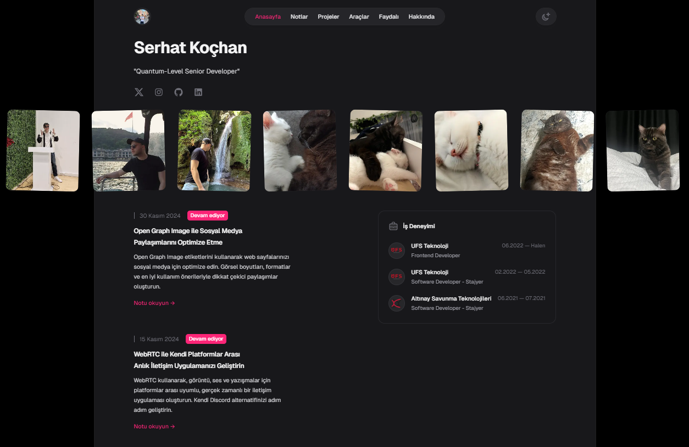
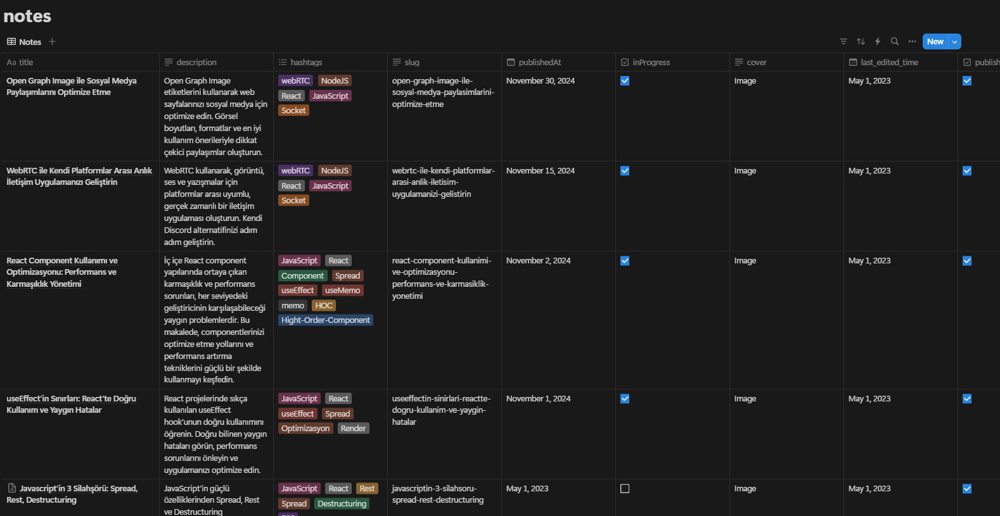
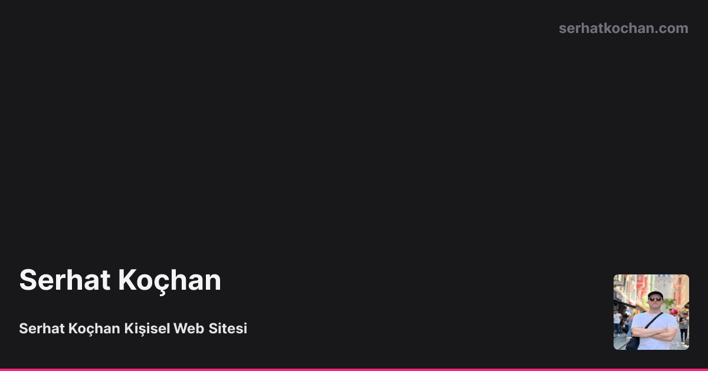
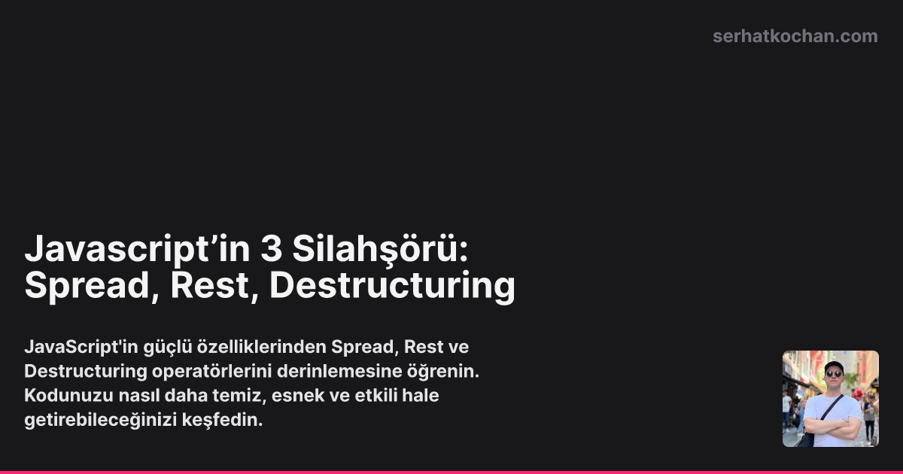

# Serhat Kochan - Next.js ve Notion ile Kişisel Web Sitesi

Bu, aşağıdaki teknolojiler kullanılarak oluşturulmuş kişisel web sitemdir:

- [TypeScript](https://www.typescriptlang.org/)
- [Next.js](https://nextjs.org/)
- [Notion API](https://developers.notion.com/)
- [Next Themes](https://github.com/pacocoursey/next-themes)
- [Tailwind CSS](https://tailwindcss.com)
- [Vercel OG](https://vercel.com/docs/concepts/functions/edge-functions/og-image-generation)

## Yerel Olarak Çalıştırma

Uygulamayı yerel olarak çalıştırmak için `.env.local` dosyasında tanımlanması gereken bazı ortam değişkenleri:

```plaintext
NEXT_PUBLIC_URL=www.serhatkochan.com
NEXT_SSL_URL=http://localhost:3000
NOTION_TOKEN=...
NOTION_DATABASE_ID=...
```

1. `NEXT_PUBLIC_URL` - mutlak URL'ler, örneğin kanonik bağlantılar ve açık grafik (Open Graph) görüntüleri oluşturmak için kullanılır.
2. `NEXT_SSL_URL` - Yerel sunucu URL'si, genellikle `http://localhost:3000` olarak ayarlanır.
3. `NOTION_TOKEN` - Notion'a erişim için API anahtarı, daha fazla bilgi için [buraya](https://developers.notion.com/docs/authorization) bakabilirsiniz.
4. `NOTION_DATABASE_ID` - Notlar ve blog yazıları için kullanılan Notion veritabanının kimliği.

### Notion Veritabanını Ayarlama

Uygulama ile çalışmak için belirli bir Notion veritabanı formatı gereklidir. Notion içinde `Notes` adlı bir veritabanı (tercihen bir Tablo) oluşturun ve şu özellikleri ekleyin:

1. `title` - Not başlığı.
2. `description` - Notun kısa açıklaması.
3. `hashtags` - Not içeriğiyle ilgili etiketler.
4. `slug` - Her not için benzersiz bir kimlik olarak kullanılır (örn. `/notes/hello-world` için `slug: hello-world`).
5. `publishedAt` - Yayın tarihi.
6. `inProgress` - Bir notun hala devam etmekte olduğunu belirtmek için kullanılır; notlar listesinde "Üzerinde Çalışılıyor" etiketi ekler.
7. `cover` - Notun kapak görseli.
8. `last_edited_time` - Son düzenleme zamanı.
9. `published` - Notun yayınlanıp yayınlanmadığını belirtir.

Notion veritabanınız aşağıdaki gibi görünmelidir:



### Uygulamayı Çalıştırma

Ortam değişkenleri ve Notion veritabanı ayarları yapıldıktan sonra aşağıdaki komutları çalıştırın:

```bash
git clone https://github.com/serhatkochan/serhatkochan.com
cd serhatkochan.com
yarn
yarn dev
```

## OG Görüntüleri Oluşturma

Uygulama, Open Graph görüntülerini otomatik olarak Vercel Edge Functions kullanarak oluşturur.

Ana sayfa örneği:


Blog gönderisi örneği:


## Vercel Üzerinde Dağıtma

[](https://vercel.com/new/clone?repository-url=https%3A%2F%2Fgithub.com%2Fserhatkochan%2Fserhatkochan.com)

## Teşekkürler

Bu proje, Bartosz Jarocki'nin [web-jarocki-me](https://github.com/BartoszJarocki/web-jarocki-me) adlı çalışmasından
ve [Tailwind UI Spotlight](https://tailwindui.com/templates/spotlight)  şablonundan esinlenerek geliştirilmiştir.

## Lisans

[MIT](https://choosealicense.com/licenses/mit/)
